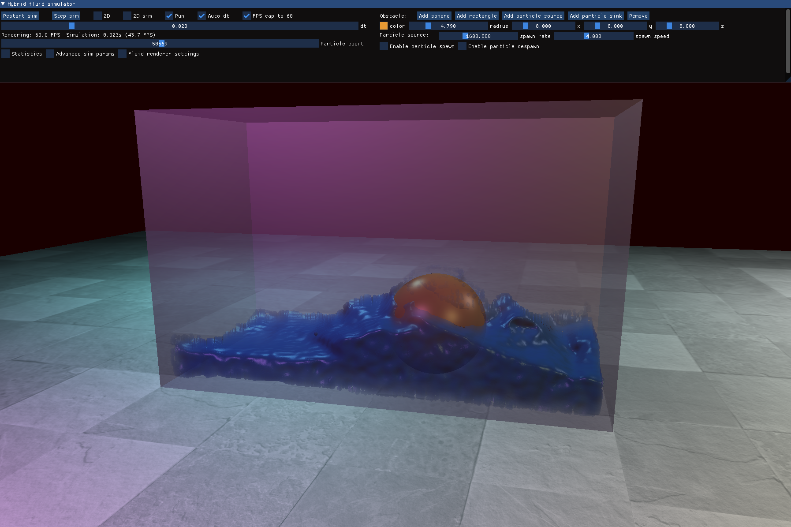
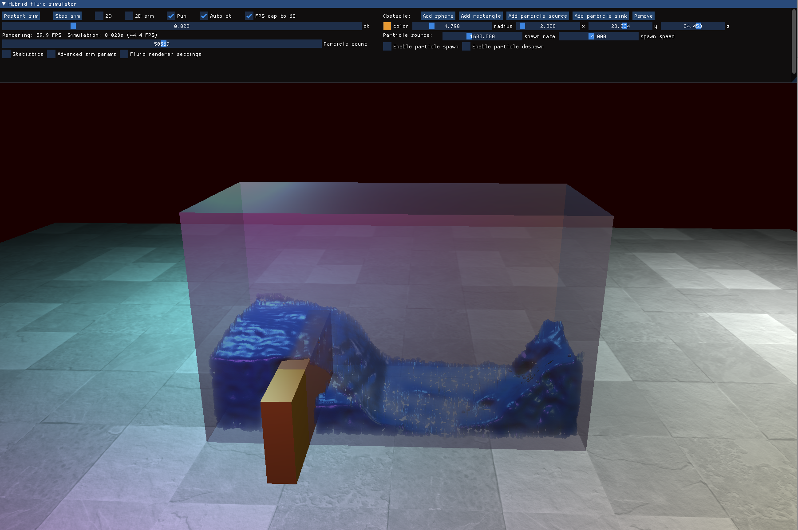
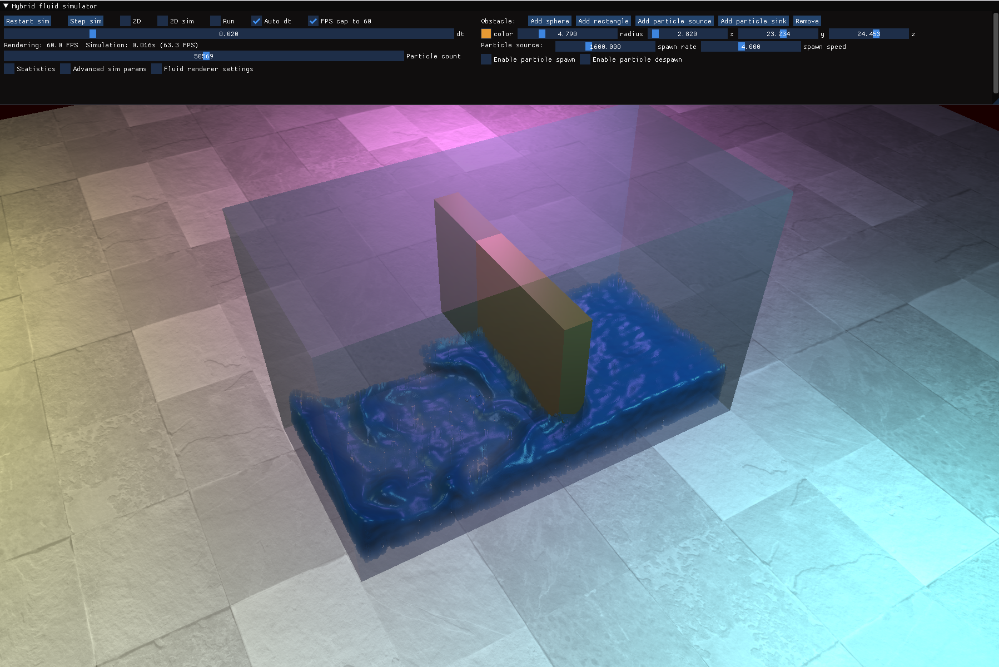
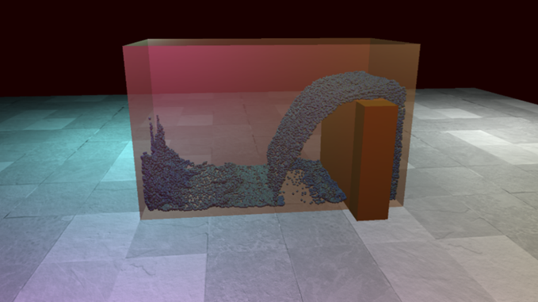
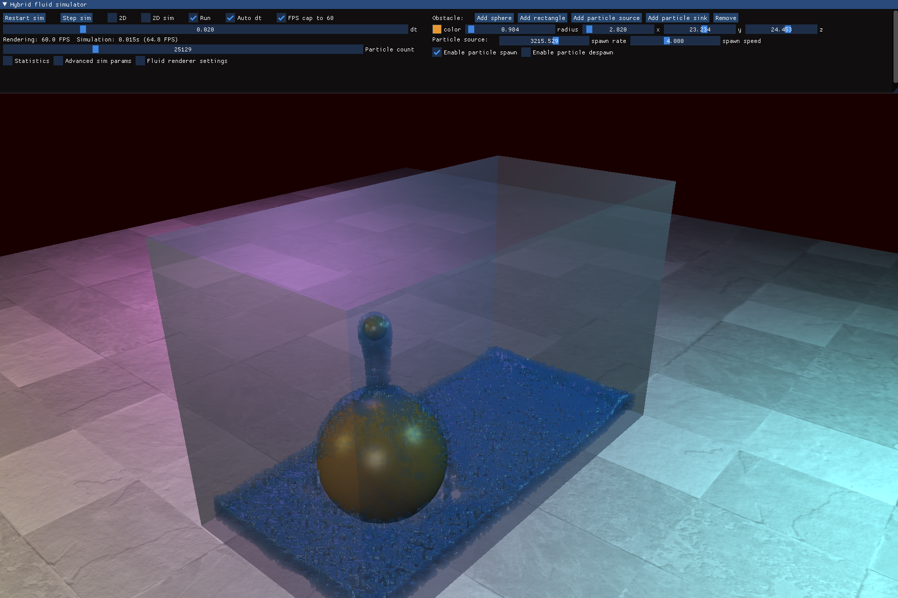
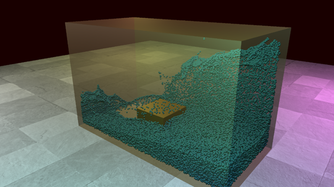

# fluid_simulator
This fluid simulation project include a FLIP/APIC fluid simulator paired with a screen-space fluid surface renderer. Furthermore, it functions as a development platform for researching, developing and testing fluid surface differentiable rendering and reconstruction techniques.

## Brief project description
TODO: update this description to reflect the current state of the project, as it has evolved quite a bit since the last update of this README.

The application is able to function in either 2D or 3D, and the user can choose between PIC/FLIP/APIC simulation modes. The simulator itself can be fine tuned pretty well, and you can also play around with obstacles and particle sources/sinks.

The fluid surface visualization is also pretty customizable, you can select between different modes, or turn it off completely.

Controls:
- WASD, SPACE and SHIFT move the camera in space
- Holding down the middle mouse button and moving the mouse rotates the camera around a fixed point
- Moving the mouse while the left button is down rotates the camera
- Moving the mouse while the right button is down moves the selected obstacle if there is any

## Build instructions
The project was built and tested using CMake and Visual Studio 2022. Before building and running the project, make sure that you have the following dependencies installed:

- The `Simulator` submodule depends on [glm](https://github.com/g-truc/glm), [spdlog](https://github.com/gabime/spdlog)
- The `RenderEngine` submodule depends on [stb_image](https://github.com/nothings/stb/blob/master/stb_image.h), [GLFW](https://github.com/glfw/glfw), [glm](https://github.com/g-truc/glm), [spdlog](https://github.com/gabime/spdlog)
- The `Application` submodule depends on [GLFW](https://github.com/glfw/glfw), [glm](https://github.com/g-truc/glm), [spdlog](https://github.com/gabime/spdlog)

## Resources that I've used during research and implementation
- Robert Bridson's `Fluid Simulation for Computer Graphics` book
- The original `The Affine Particle-In-Cell Method` paper
- [Dear ImGui](https://github.com/ocornut/imgui) - for the UI
- [libfluid](https://github.com/lukedan/libfluid) - this helped me in the correct implementation of the incompressibility solver from Bridson's book
- Matthias Müller: [Ten Minute Physics videos](https://www.youtube.com/channel/UCTG_vrRdKYfrpqCv_WV4eyA) - an amazing channel that really helped me to get started from zero fluid simulation knowledge
- `Screen space fluid rendering with curvature flow` paper for the screen space fluid surface computation and rendering

## Results
 
 
 
