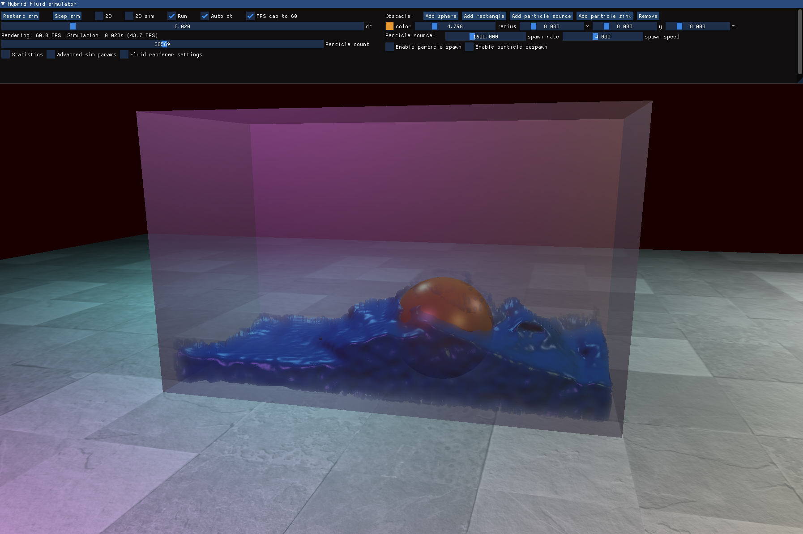
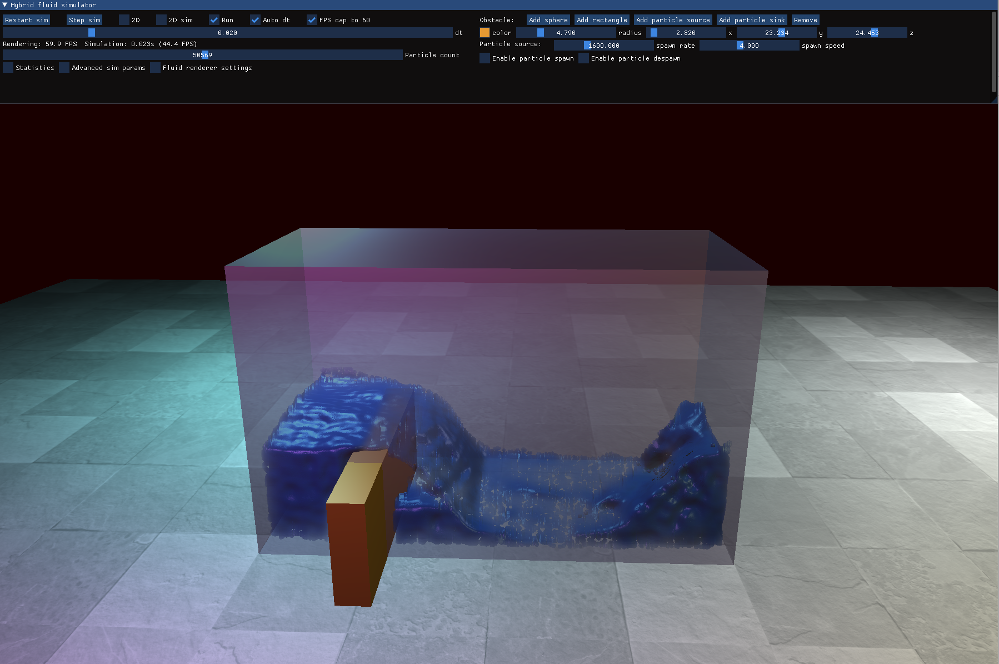
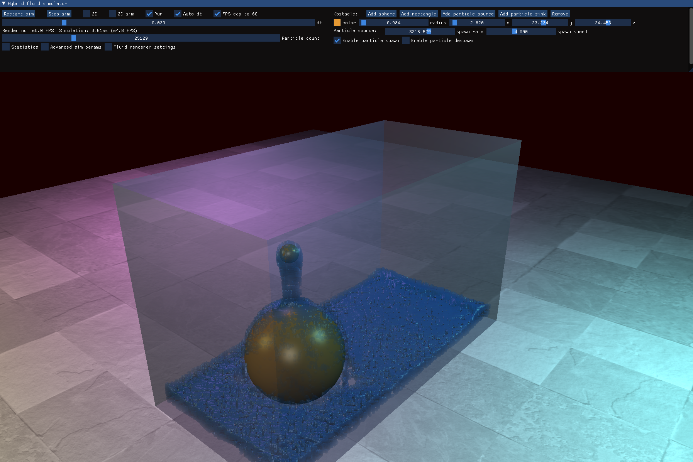

# fluid_simulator
A basic 3D PIC/FLIP/APIC fluid simulation application

## Brief project description
This is a pretty basic fluid simulation project that I've made as a part of my BSc thesis.

The application is able to function in either 2D or 3D, and the user can choose between PIC/FLIP/APIC simulation modes. The simulator itself can be fine tuned pretty well, and you can also play around with obstacles and particle sources/sinks.

Controls:
- WASD, SPACE and SHIFT move the camera in space
- Holding down the middle mouse button and moving the mouse rotates the camera around a fixed point
- Moving the mouse while the left button is down rotates the camera
- Moving the mouse while the right button is down moves the selected obstacle if there is any

## Build instructions
The project was built and tested using Visual Studio 2022. Before running the main Application project you must configure the dependency paths for all 3 subprojects:

- The `Simulator` subproject must have the include path configured for [glm](https://github.com/g-truc/glm)
- The `RenderEngine` subproject must have the include paths configured for [stb_image](https://github.com/nothings/stb/blob/master/stb_image.h), [GLFW](https://github.com/glfw/glfw), [glm](https://github.com/g-truc/glm)
- The `Application` subproject must have the include paths configured for [GLFW](https://github.com/glfw/glfw), [glm](https://github.com/g-truc/glm)
- The `Application` subproject must have an additional lib path to the GLFW lib-vc2022 directory

## Resources that I've used during research and implementation
- Robert Bridson's `Fluid Simulation for Computer Graphics` book
- The original `The Affine Particle-In-Cell Method` paper
- [Dear ImGui](https://github.com/ocornut/imgui) - for the UI
- [libfluid](https://github.com/lukedan/libfluid) - this helped me in the correct implementation of the incompressibility solver from Bridson's book
- Matthias Müller: [Ten Minute Physics videos](https://www.youtube.com/channel/UCTG_vrRdKYfrpqCv_WV4eyA) - an amazing channel that really helped me to get started from zero fluid simulation knowledge

## Results
 
 
 
